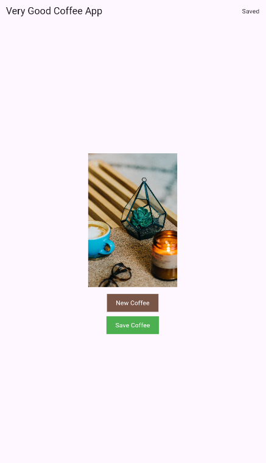

# ☕ Very Good Coffee App

A Flutter application that lets users discover, enjoy, and save their favorite coffee images — even offline.

Built with clean architecture using `flutter_bloc`, `hive`, and `cached_network_image`.
Supports both Android and iOS.
Designed for performance, offline access, and maintainability.

---

## Features

- Load a random coffee image from the [Coffee API](https://coffee.alexflipnote.dev)
- Tap “New Coffee” to fetch another image
- Save your favorite coffee images locally (via Hive)
- Works with proxy support on Web (via CORS proxy)
- Offline access to saved coffee images
- Error handling with retry flow

---

## Tech Stack

- **Flutter** (3.x)
- **flutter_bloc** – state management
- **Hive** – local storage
- **cached_network_image** – optimized image caching
- **http** – API communication
- **bloc_test + mocktail** – unit & widget testing

---

## 🚀 Getting Started

### 1. Clone the repo

```bash
git clone https://github.com/adanop7721/Very_Good_Coffee_App.git
cd Very_Good_Coffee_App
```

### 2. Install dependencies

```bash
flutter pub get
```

### 3. Generate Hive adapter

```bash
flutter packages pub run build_runner build
```

### 3. Run the app

```bash
flutter run
```

## Testing

Run all tests:

```bash
flutter test
```

Test coverage: ~80%

- Unit tests for BLoC and repository logic
- Widget tests for screen rendering & interactions

## Screenshots



